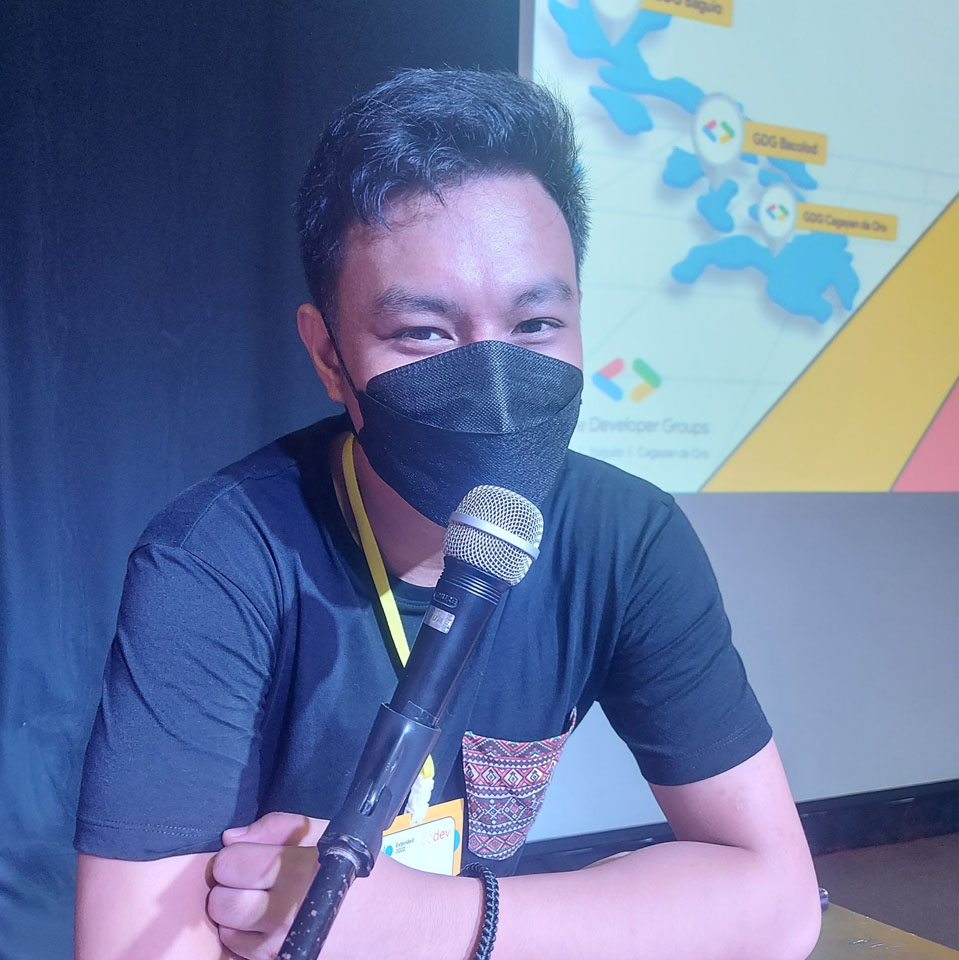
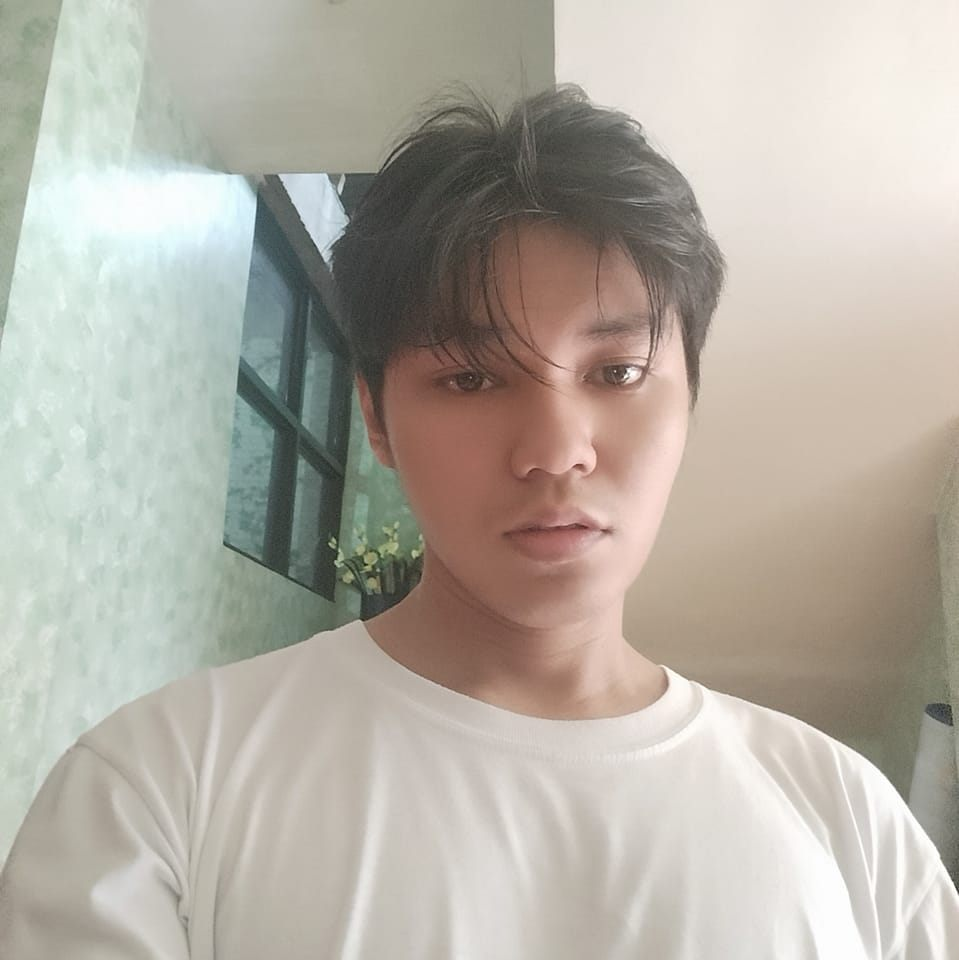
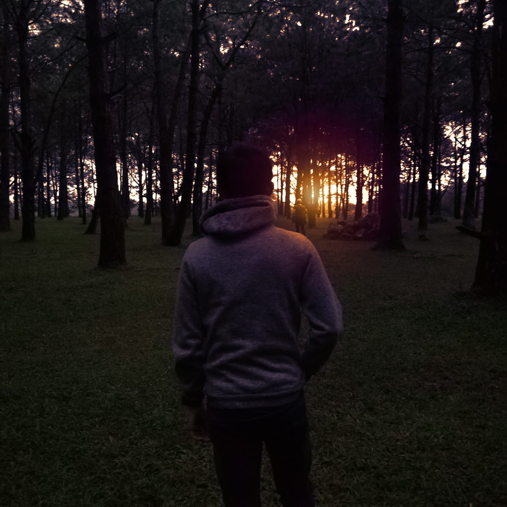

## $${\color{#e5b336}Institue \space of \space Computer \space Engineers \space of \space the \space Philippines \space Student \space Edition}$$ -  $${\color{#c51e3a}Technological \space University \space of \space the \space Philippines \space Visayas}$$  Website

  

This is the source code for the $${\color{#e5b336}ICpEP \space - \space SE.TUPV}$$ Website. This website is solely for marketing and introducing what $${\color{#e5b336}ICpEP \space - \space SE.TUPV}$$ do. The website is composed of $${\color{#e34c26}HTML}$$, $${\color{#264de4}CSS}$$, and $${\color{#f0db4f}JavaScript}$$ in the making. It was a challenge at first on how to do the color scheme but the developers followed the contrast of the logo of $${\color{#e5b336}ICpEP \space - \space SE.TUPV}$$.  

<h2 align="center">Website Developers</h2>

  
  
  
  

  
Lanz Joseph Villanueva

  
Neil Francis Yangyang

  
Nicholas Gabriel Locson

  
Ariel Malihoc Jr.

  
Project Manager

  
UI/UX Designer

  
Project Architect

  
QA and Testing Specialist

